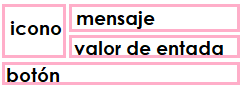

# JOptionPane

Componente de Swing que permite mostrar cuadros de diálogo con información.

## Métodos

| Métodos | Descripción|
|---------|------------|
| **showConfirmDialog**|Realiza una pregunta, si/no/cancelar.|
| **showInputDialog**  |Solicita una entrada.|
| **showMessageDialog**|Notifica al usuario algo que está sucediendo.|
|  **showOptionDialog**|Unificación de los 3 métodos anteriores.|

## Diseño de los cuadros de diálogo

## Parámetros
**_parentComponent_ :** Define el componente que será el padre del cuadro de diálogo.

**_message:_** Mensaje descriptivo que se colocará en el cuadro de diálogo, su interpretación depende del tipo.

**_Object[]:_** Arreglo interpretado como una serie de mensajes.

**_Component:_** Componente mostrado en el cuadro de diálogo.

**_Icon:_** Creado en JLabel y mostrado en el cuadro de diálogo.

**_messageType:_** Define el estilo del mensaje, puede mostrar un icono por predeterminado. Los valores podrían ser:
`ERROR_MESSAGE`
`INFORMATION_MESSAGE`
`WARNING_MESSAGE`
`QUESTION_MESSAGE`
`PLAIN_MESSAGE`

**_optionType:_** Define la opcion del botón que va a mostrar en el cuadro de diálogo.
`DEFAULT_OPTION`
`YES_NO_OPTION`
`YES_NO_CANCEL_OPTION`
`OK_CANCEL_OPTION`

No se limita solo a las opciones anteriores, puedes probar cualquier botón utilizando el parámetro de opciones.

**_options:_** Descripción más detallada del conjunto de botones de opción que aparecerán en la parte inferior del cuadro de diálogo.

**_Component:_** El componente se agrega directamente a la fila de botones.

**_Icon:_** JButton lo crea como etiqueta (label).

**_other:_** El objeto se convierte en una cadena de string (toString) y el resultado se usa para etiquetar un `JButton`.

**_icon:_** Icono decorativo que se colocará en el cuadro de diálogo. El valor predeterminado es asignado por el parámetro `messageType`.

**_title :_** Título del cuadro de diálogo.

**_initialValue:_** Selección predeterminada (valor de entrada).

## PROYECTO REALIZADO 
> El proyecto es un seguimiento del vídeo [**Cómo usar JOptionPane de Swing, Programación Orientada a Objetos con Java**](https://youtu.be/wJIdGFrVjXs)

## MATERIAL ADICIONAL
> Información obtenida de:
> 
> [Class JOptionPane](https://docs.oracle.com/javase/8/docs/api/javax/swing/JOptionPane.html)
> 
> [How to Make Dialogs](https://docs.oracle.com/javase/tutorial/uiswing/components/dialog.html)