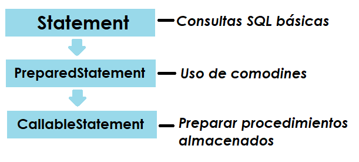

# JAVA DATABASE CONNECTIVITY

### PreparedStatement
- Hereda de Statement, la especializa para poder utilizar parametros. 
- Utiliza comodines **"?"** para determinar los parámetros a enviar a la BD.
- Se compila una vez y se llama **n veces**.

### PATRÓN DE DISEÑO DAO (Data Acess Object)
* Objetivo: Encapsular la fuente de datos.
* Ocultar los métodos para acceso a datos.
* Existen arquitecturas y tecnologías que mejoran este patrón.

## PROYECTO REALIZADO
> El proyecto es un seguimiento del video [**Patrón de Acceso a Datos, DAO, JDBC parte 5 de conexiones a bases de datos con Java**](https://youtu.be/_ORq62VV2Yo)